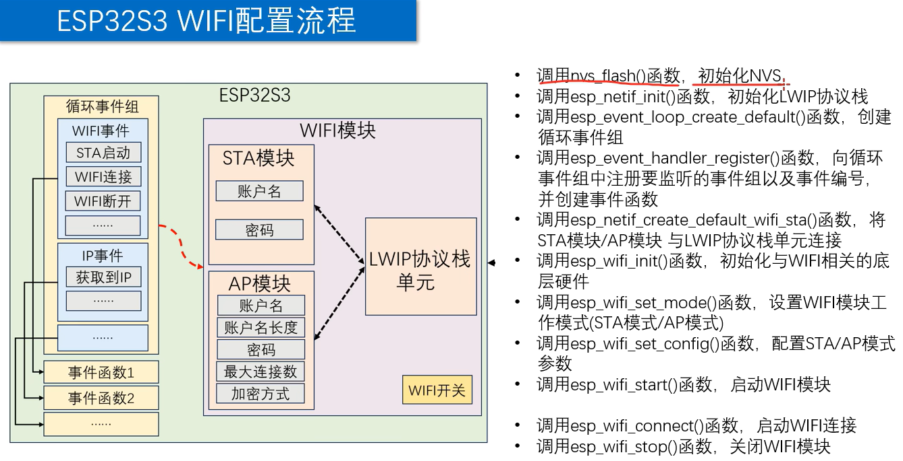
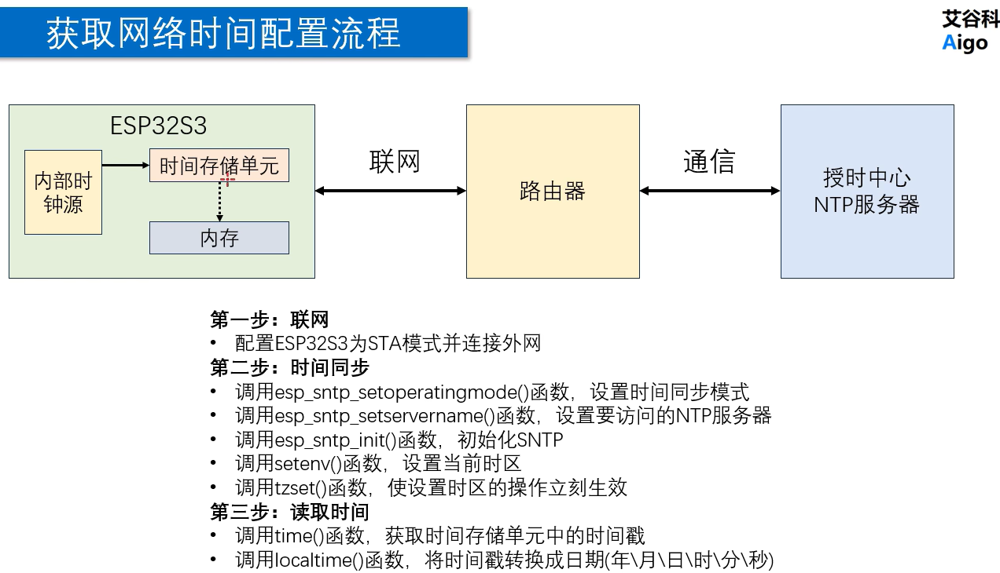

8.22 WIFI





第一步：先完成用esp32 连接家里的网络

成功

1.strlcpy（）是把字符串内容复制到数组中,下面的是我写的上面的是机器改正的

```c++
strlcpy((char *)wifi_config.sta.ssid,
        WIFI_SSID,
        sizeof(wifi_config.sta.ssid));

strlcpy((char *)wifi_config.sta.password,
        WIFI_PASSWORD,
        sizeof(wifi_config.sta.password));
```

```c++
wifi_config_t wifi_config = {
    .sta = {
        .ssid = WIFI_SSID,
        .password = WIFI_PASSWORD,
    }
};
```

ssid和password是数组，而我输入进去的内容是字符串，这样复制容易出现问题

可以理解成把 `WIFI_SSID` 这个字符串，复制到 `wifi_config.sta.ssid` 这个盒子里，但是最多只能按照 `ssid` 盒子的大小来复制。

```
strlcpy(目标, 来源, 目标有多大);
```

2.

ESP-IDF的API可能会因为种种原因失败，如果不检查返回值即使失败了也还是往下跑，只要函数返回 `esp_err_t`，优先考虑 `ESP_ERROR_CHECK()`

3.

NVS是非易失性存储，存在与FLASH的某个分区里面，这个nvs不是用来连接wifi的，而是给esp-idf的wifi提供一个掉电保存配置的能力

既然每次启动程序都重新设置 SSID 和密码，那 NVS 保存它们还有什么意义？

我做的这个demo可能不太明显，产品级的东西，创作者不可能知道用户家的wifi，用户第一次拿到产品就会配置wifi，然后用户断电，比如第二次打开，就可以在NVS中找到保存的wifi ssid和密码了，如果没有nvs的话，信息将全部丢失

第二步：和服务器通信获取时间

