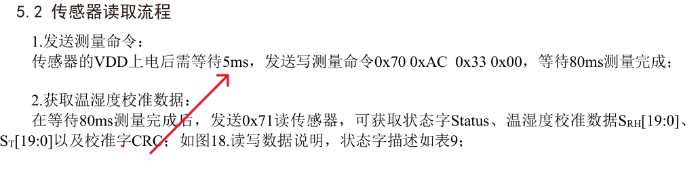
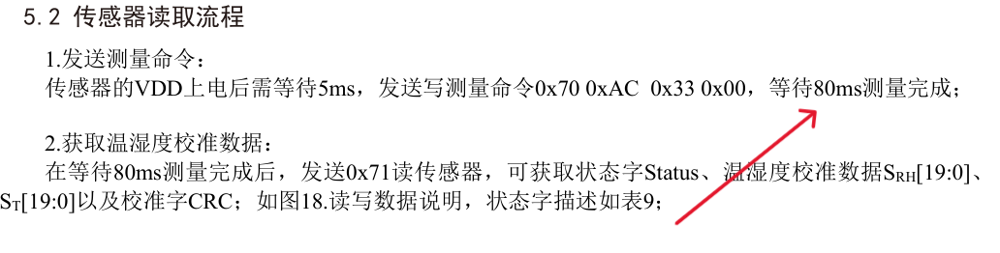
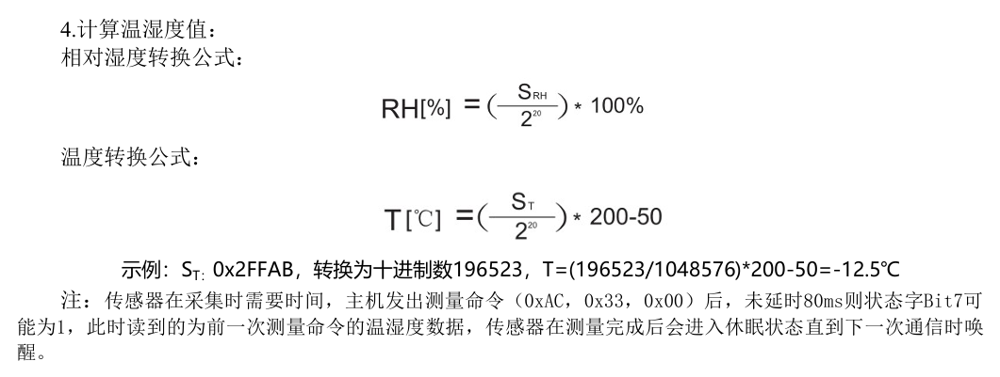

# AHT20 Arduino I2C Reader

## 一、项目简介

  本项目使用 Arduino 自带 Wire 库，通过 I2C 总线读取 AHT20 温湿度传感器数据，并在串口监视器中输出温度和湿度。

## 二、传感器的基本信息

|          内容          |       参数        |
| :--------------------: | :---------------: |
|         传感器         | AHT20温湿度传感器 |
|        通信方式        |        I2C        |
|        供电电压        |    2.2V～5.5V     |
| Arduino中使用的I2C地址 |       0x38        |
|     手册中的写地址     |       0x70        |
|     手册中的读地址     |       0x71        |
|        测量命令        |  0xAC 0x33 0x00   |

## 三、硬件接线

| AHT20引脚名称 | ESP32 板子引脚名称 |
| :-----------: | :----------------: |
|      VDD      |      3.3V或5V      |
|      GND      |        GND         |
|      SDA      |       GPIO21       |
|      SCL      |       GPIO22       |

## 四、软件环境

开发板：ESP32

开发环境：Arduino IDE

使用库：Wire.h（ Arduino 自带 ，不需要额外安装第三方库）

串口波特率：9600

I2C频率：100kHz

## 五、使用方法

1. 按照接线表连接 AHT20 和 ESP32开发板。

2. 打开 Arduino IDE。

3. 将代码上传到 ESP32开发板。

4. 打开串口监视器。

5. 设置波特率为 9600。

6. 串口会每 1 秒输出一次温度和湿度。

   示例输出如下

   ```
   temperature:
   26.35C
   hunidity:
   30 %RH
   ```

## 六、AHT20通信流程

1. 传感器上电后等待至少 5ms。

   

2. ESP32 通过 I2C 向 AHT20 发送测量命令 `0xAC 0x33 0x00`。

3. 发送完成后等待 80ms，让传感器完成温湿度测量。

   

4. 通过 `Wire.requestFrom(0x38, 7)` 从 AHT20 读取 7 个字节。

5. 判断 `data[0]` 的 Bit7，如果 Bit7 为 1，说明传感器仍然忙。

6. 如果 Bit7 为 0，则解析湿度 20bit 数据和温度 20bit 数据。

7. 根据公式换算得到实际湿度和温度。

## 七、温湿度计算公式



```
uint32_t rawHumidity =
  ((uint32_t)data[1] << 12) |
  ((uint32_t)data[2] << 4) |
  ((uint32_t)data[3] >> 4);

uint32_t rawTemperature =
  (((uint32_t)data[3] & 0x0F) << 16) |
  ((uint32_t)data[4] << 8) |
  data[5];

float humidity = rawHumidity * 100.0 / 1048576.0;
float temperature = rawTemperature * 200.0 / 1048576.0 - 50.0;
```

AHT20 的湿度和温度原始数据都是 20bit，因此使用 uint32_t 保存，并将有效数据放在低 20 位。

## 八、常见问题

1 . 为什么代码里要用0x38而不是0x71？

   Arduino Wire 库使用 7 位 I2C 地址，一共传输了八位数据其中前7位作为地址而第8位作为读写控制位,相当于主机给了地址然后告诉你要在这个地址做读操作还是写操作。

> AHT20 的 7 位地址是 0x38。Wire.requestFrom(0x38, 7) 在总线上实际发出的就是读地址 0x71。

2 . 串口显示ovf是什么原因

   通常是读取失败后仍然打印未赋值的 temp 变量。应该先判断 readAHT20() 是否返回 true，再打印温湿度。

3 . uint8_t是什么意思和int类型有什么区别

   ```
   u      = unsigned，无符号，不能表示负数
   int    = integer，整数
   8      = 8 bit
   _t     = type，类型
   ```

所以uint8_t的意思是无符号8位整数类型

和int类型的区别主要表现在所占空间，数值范围上，uint8_t所占空间是确定的1字节，而int在不同的开发板上所占空间不一样

```
Arduino UNO 上 int 通常是 16 bit
ESP32 上 int 通常是 32 bit
```

4 . &&和&不一样，||和|也不一样

   &&是逻辑与，用来判断两个条件，比如

```
if (a > 0 && b > 0)
```

   &则是按位与，用来检查二进制，比如

```
if (data[0] & 0x80)
```

   ||是逻辑或，|是按位或，常用于拼接二进制，比如

```
rawTemperature =
  (((uint32_t)data[3] & 0x0F) << 16) |
  ((uint32_t)data[4] << 8) |
  data[5];
```

