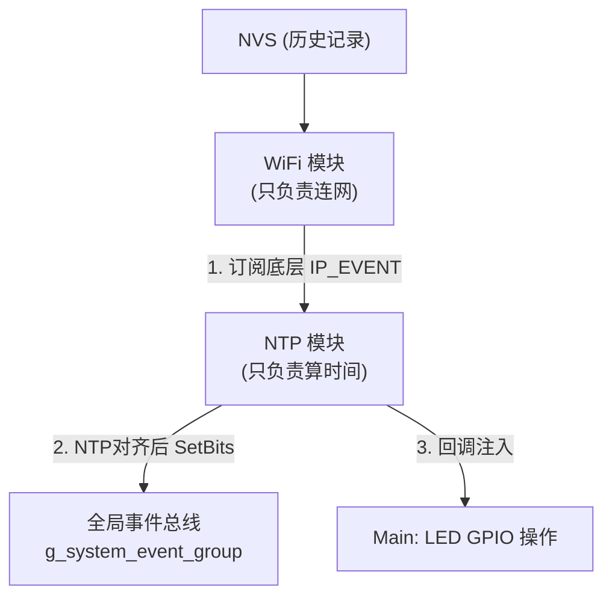

# ESP-IDF C++ 工业级架构学习项目：精准时钟与事件驱动

## 📖 项目简介
这是一个为了学习 ESP-IDF C++ 面向对象编程与 FreeRTOS 高级特性的实战项目。
项目要求实现两个模块（WiFi 模块 和 NTP 时钟模块）的联动，并驱动两个 LED 指示灯：
1. **连接逻辑**：设备连上 WiFi 后，才允许开始 NTP 矫正时间。
2. **LED 1 (GPIO 13)**：半秒钟亮，半秒钟灭，并且**必须与北京时间严格对齐**。
3. **LED 2 (GPIO 14)**：在每一分钟的“整分钟”时刻闪烁一下。

此项目摒弃了初学者常用的“延时轮询（Delay-Polling）”写法，采用了**大厂工业级**的解耦架构，具有极高的稳定性和可扩展性。

---

## 🎯 核心学习目标 (知识点)

### 1. ESP-IDF 中的 C++ Class 用法
在嵌入式开发中，将功能封装成 C++ 类能大幅提高代码可维护性。
- **静态类封装 (Static Class)**：如 `WifiModule`。由于系统里只有一个 WiFi 硬件，我们将方法和状态变量设为 `static`，直接通过 `WifiModule::init()` 调用。
- **单例模式 (Singleton)**：如 `NtpModule`。通过 `NtpModule::getInstance()` 获取全局唯一实例，防止被多次实例化。
- **回调函数 (std::function)**：NTP 模块负责算时间，但**不直接操作 GPIO**。它通过 `registerHalfSecondTick()` 暴露出回调接口，在 `app_main` 中将 LED 操作注入进去。这实现了“底层硬件逻辑”与“上层业务逻辑”的解耦。

### 2. FreeRTOS：事件标志组 (EventGroup)
如何让 NTP 模块知道 WiFi 连上了？
- ❌ **错误做法**：在 WiFi 代码里 `#include "ntp.h"` 然后调用 `ntp_start()`。（模块间强耦合）
- ❌ **错误做法**：NTP 写一个 `while(1)` 死循环，每隔100ms去问 WiFi "连上了吗？"。（浪费 CPU 资源）
- ✅ **大厂做法**：使用 **事件标志组 (EventGroup)**。
  我们在 `system_event.h` 中定义了一个全局的黑板 `g_system_event_group`。
  - WiFi 模块连上时，在黑板上写上：`SYS_EVT_WIFI_CONNECTED = 1`。
  - NTP / MQTT / 传感器等模块，只需要用 `xEventGroupWaitBits()` 盯着这块黑板。只要条件满足，它们就会被 FreeRTOS 自动唤醒。模块之间互不认识，完美解耦。

### 3. FreeRTOS：任务通知 (TaskNotification) 与 ISR 最佳实践
如何做到 0.5 秒极度精准的闪烁？
- ❌ **错误做法**：`vTaskDelay(500)`。因为代码执行需要时间，每次 Delay 都会产生几毫秒误差，一天下来会慢好几秒，无法对准北京时间。
- ✅ **正确做法**：使用硬件定时器 (`esp_timer`)。
  NTP 同步成功时，计算出当前距离“下一个整秒”还差多少微秒，然后启动定时器严格对齐。
- ⚠️ **ISR（中断服务函数）的铁律**：**快进快出，绝不墨迹**。
  在硬件定时器的回调函数（ISR上下文）里，**绝对不能**执行打印日志、计算复杂逻辑或调用 `vTaskDelay`。
  本项目的解法是：在定时器中断里，只做一件事——调用 `xTaskNotifyGive()` 像打响指一样发送一个信号。
  然后在普通的 vTask (如 `half_second_task`) 中调用 `ulTaskNotifyTake()` 阻塞等待这个响指。响指一响，Task 醒来去干控制 LED 的重活。

---

## 🏗️ 系统架构设计

### 模块依赖图


### 运行流程详解
1. **启动阶段**：`app_main` 依次初始化 事件总线 -> NVS -> WiFi -> NTP。此时 WiFi 开始连接，NTP 静默等待。
2. **WiFi 连上**：
   - 底层 LwIP 发出 `IP_EVENT_STA_GOT_IP`。
   - NTP 模块之前订阅了这个事件，它的 `daemon_task` 瞬间被唤醒。
   - NTP 开始执行 `esp_sntp_init()` 发起时间同步。
3. **精准对齐**：
   - NTP 收到阿里云服务器的时间包，得知当前是 `12:00:00.300` (多出了 300ms)。
   - NTP 算出距离下一个整秒还差 `700ms`。
   - 设定一次性硬件定时器，延时 700ms 后触发。
   - 触发时，正好是北京时间的**整秒边界**。此时启动 500ms 周期定时器，从此每一次触发都在 .000 或 .500 时刻！
4. **中断驱动 LED**：
   - 500ms 硬件定时器到期 → 中断里调用 `xTaskNotifyGive` 唤醒 `half_sec_task`。
   - Task 醒来，读取系统时间判断是前半秒还是后半秒，调用回调函数翻转 LED 1。

---

## 🚀 未来扩展 (为什么这么设计？)

如果明天项目经理说：**“我要加一个 MQTT 把时间传到云端，还要加一个传感器，必须等 WiFi、NTP、MQTT 全都准备好了才能采集数据。”**

如果你用以前乱糟糟的耦合代码，整个逻辑要重构。
但在我们这个工业级架构下，你只需要：
1. 在 `system_event.h` 里加一个 `SYS_EVT_MQTT_CONNECTED = BIT2`。
2. 写一个 MQTT 模块，成功连上云就 `SetBits(BIT2)`。
3. 写一个传感器 Task，开头写一句：
   ```cpp
   xEventGroupWaitBits(bus, WIFI_BIT | NTP_BIT | MQTT_BIT, ...);
   ```
   **一行代码，就实现了完美的依赖等待。旧代码一行都不用改！** 这就是架构设计的魅力。
