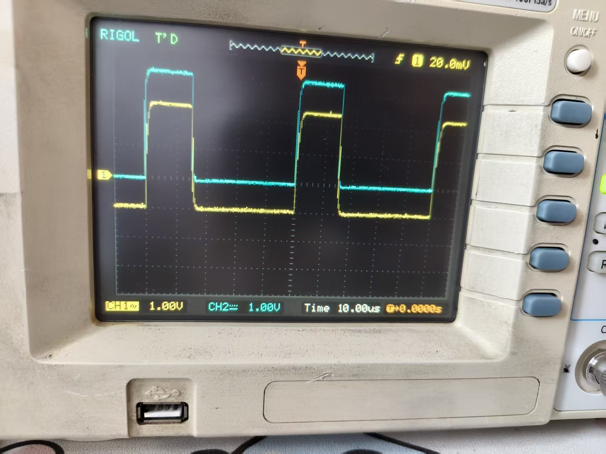
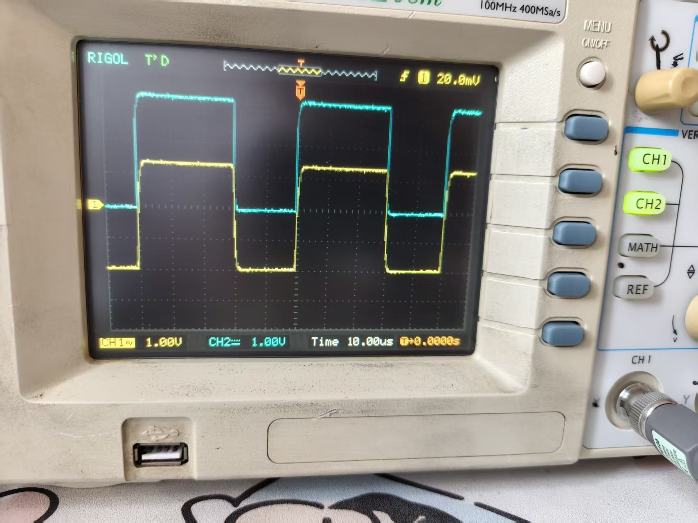
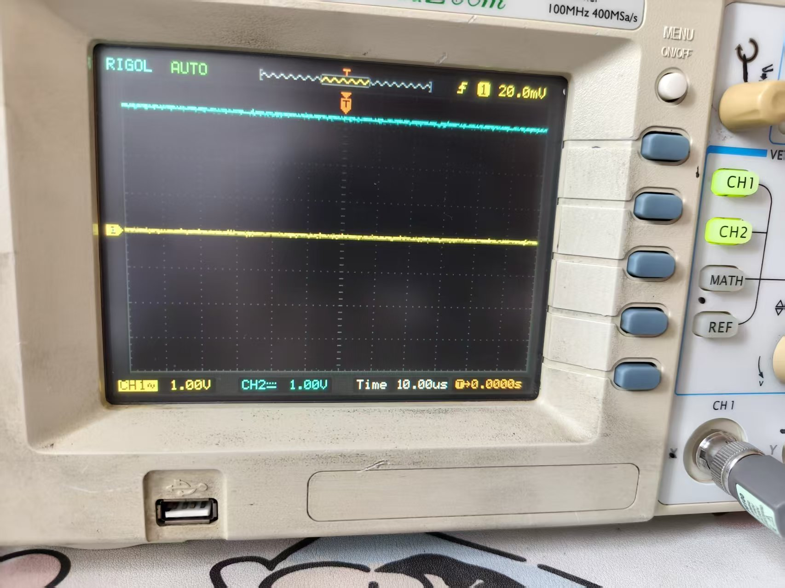
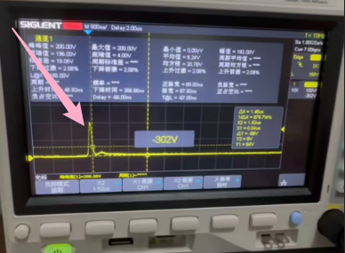

# 示波器测量PWM

## 要求

> 使用示波器，ESP32，MOS管，130电机，完成一次PWM波形测量实验
>
> 实现功能: 使用示波器测量实验3中ESP32输出的PWM波形，能稳定显示波形，并且读出频率，占空比，周期，脉宽，高电平电压，低电平电压
>
> 测量MOS管G极的PWM波形，改变30%，60%，100%三档转速，观察波形有什么变化
>
> 使用SINGLE抓电机关闭瞬间的波形，对比有续流二极管和没有续流二极管时波形有什么区别
>
> 需要学会的内容：探头1X/10X区别，探头校准，电压档位，时间档位，触发电平，边沿触发，AUTO，RUN/STOP，SINGLE，自动测量，保存波形截图
>
> 重点理解：触发用来让波形稳定，SINGLE用来抓一次性波形，脉宽就是一个周期里高电平持续的时间，占空比就是脉宽除以周期
>
> 波形照片和结论写到README中

## 步骤

1. 使用示波器自带校准信号，完成探头校准
2. 测量ESP32的PWM输出引脚，让波形稳定显示
3. 读出频率，周期，脉宽，占空比，高电平，低电平
4. 分别设置30%，60%，100%占空比，记录三张波形图
5. 测量MOS管G极PWM波形，确认G极收到的控制信号和ESP32输出一致
6. 接上续流二极管，用SINGLE抓电机关闭瞬间波形
7. 去掉续流二极管，再用SINGLE抓一次电机关闭瞬间波形
8. 对比两张图，说明续流二极管有什么作用

## 学习过程

汪某心理：今天6.27，好不容易爬到了3.5，竟然还出了个什么3.5，i听起来就跟我这个3持续了很长很长时间了一样。今天完成3.5和5，初期的计划是，走一步看一步，晚上的时候再调整

朱给发的那一堆东西看完了，讲的就是为什么我的mos管会嘎掉，就是mos突然断电，电感为了维持电流，会在mos的DS极之间上产生一个特别大的反向电压出现，100多伏就把我的mos给击穿了

好，那么正式开始今天3.5的内容

好，抓也抓不到，放弃

分别设置30%，60%，100%占空比，记录三张波形图，测量MOS管G极PWM波形，确认G极收到的控制信号和ESP32输出一致（黄色的是ESP32的,蓝色是G极的PWM波形，经确认是一致的）：

去掉续流二极管，用SINGLE抓一次电机关闭瞬间波形（是朱抓的，我抓不到，据说是环境比较恶劣）：

这个就是没有二极管的，电机突然断电，点电感为了维持电流不变，会在MOS 山产生一个电压将近200V，会把MOS管当场击穿。续流二极管在这里用来保护MOS管的

探头校准，电压档位，时间档位，触发电平，边沿触发，AUTO，RUN/STOP，SINGLE，自动测量，保存波形截图（这些我已经可以在示波器上演示了）

探头1X/10X区别：1X就是信号不会衰减，是多少在示波器上读出来的就是多少，适合测很小的信号；10X就是信号会衰减十倍，比如本来是10V，那么只有1V进入示波器，然后如果探头是10X档，就会显示10V，平时都是用10X档。

