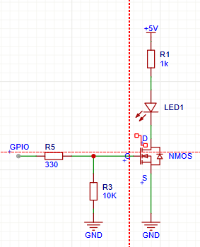
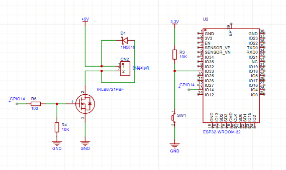
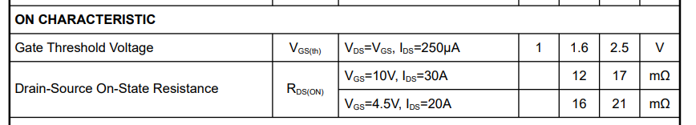
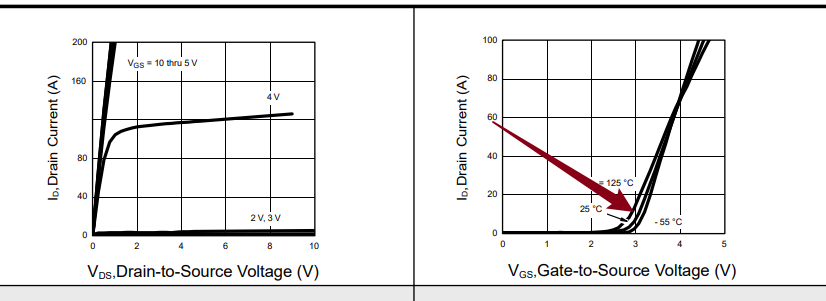
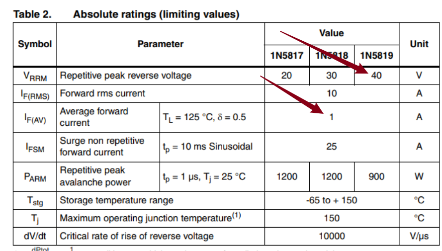
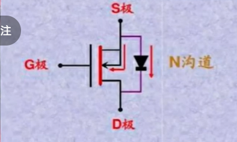

调速小风扇

## 要求

> 使用MOS管，esp32，直流有刷电机，按钮，制作一个调速小风扇
>
>  实现功能: 开机风扇不转，按一下按钮转速 30%，再按一下按钮转速60%，再按一下风扇转速100%，再按一下风扇转速30%...以此类推，长按按钮两秒关闭风扇
>
>  学会MOS管选型，可以手绘电路图（或**建议**使用“立创EDA”画出电路图）
> 然后去淘宝上购买相关材料，并且完成该项目
>
>  需要学会的内容： PMOS和NMOS区别（分别画出两个电路图），PWM调速原理(
> 有效电压），MOS-Gate上下拉电阻（并且知道如果没有会发生什么，应该选多大?为什么?)
>
>  代码格式化后提交，代码优雅不要堆积如山

## 学习过程

#### 1.PMOS和NMOS区别

PMOS就是导通之后，沟道是P型载流子，如果沟道里面是N型载流子则是NMOS.

​ 首先就是G极到S极的电压不一样NMOS导通的条件是VGS>0,而PMOS导通的条件是VGS<0；其次连接方式也不一样，NMOS是下管，PMOS是上管。
下图分别是我的NMOS和PMOS的电路图。



PMOS的就是在GPIO输入端输入一个高电平把小NMOS导通，之后PMOS的G极就可以收到一个低电平，从而导通了

#### 2.PWM调速原理

就相当于一个告诉开关比如MOS管这种，去控制供电。比如转速为30%，那就让这个MOS控制一个周期里面30%的时间给高电平，让风扇由于惯性区转动。ESP32并不直接控制风扇，只负责发PWM信号，而MOS负责执行，风扇因为惯性表现出不同的转速。

> PWM等效电压的概念
>
>并不是真的输出了这个电压，而是通过快速开关让负载在平均效果上好像收到了一个较低的电压（因为负载来不及完全相应每一次快速开关）
>
>比如5V电压，30%的占空比，那么此时的等效电压就是1.5V

#### 3.MOS GATE的上下拉电阻

作用在GPIO没有明确输出的时候给G极一个明确的电平，防止MOS管乱开，最常用的是10kΩ，不会浪费太多电流0.33mA和0.5mA完全在ESP32的承受范围内，选用电阻太大的会导致不稳定，选择电阻太小的会浪费电流。

#### 4.原理图



#### 5.选型：

1 . MOS管：UMW IRFZ44N





原因：在第一个表格中可以看到电压在1.6V-2.5V的时候，漏源之间有微弱的电流，不能认为MOS已经完全导通了，4.5V的时候可以较好导通，在3.3V的时候就处于一个能导通的状态但是不能保证MOS处于一个低内阻的状态，在几百毫安这种小电流的情况时可以使用的，我的小风扇预估电流应该在0.5A这种，所以可以用；再看下面的坐标图，在栅源电压在3.3V且TC为25度的时候漏极电流在10A左右，满足风扇的电流需求，所以选择这个MOS管

2 . 二极管：1N5819

​ 选择理由：插针（适合我的面包板）耐压值为40V，风扇在5V完全够用，平均正向电流是1A,瞬间最大电流位25A，速度快，适合电机续流保护



> 为什么不选择其它型号的二极管呢？
>
> mos突然关闭的时候，电感为了维持电流会产生一个电压，这时候就需要二极管了，所及二极管要满足正向压降低，导通快等特点，这个肖特基二极管最主要的特点是导通压降小。
> TVS:在击穿的瞬间保护一下
> 快恢复二极管：常用于高频电流，也可以用，但是不划算
> 齐纳二极管：主要用于稳压和限压而我这个电路需要的是续流二极管

> 为什么需要二极管呢：
>
> 因为电机本质上是个电感，电机通电的时候如果MOS突然断电，电感为了维持电流不变（假设没有二极管）会在MOS上面产生一个巨大的电压直接把MOS击穿

> 如果没有会产生多大的反向电压呢？
>
>会产生多大反向电压，不是一个固定值，它取决于电机电感、电流、MOS 关断速度等
>
>估算公式: V = L × ΔI / Δt
>
>L = 电机绕组电感
> ΔI = 关断前电机电流
> Δt = 电流被切断的时间

> 电感电流方向在关断的瞬间不变，电感电压方向会翻过来，以维持这个电流继续
>
>电感感应电压的方向总是反抗电流的方向，电流增加他就会产生一个反向电压组织电流增加，电流减小就产生一个反向电流阻止他减小

电机高速小马达：淘宝链接（从朱方获取）

## 结论

##### 1.如何用万用表判断mos管的好坏

我的万用表是要按一下SEL/REL才可以切换到二极管的状态，我用的是Nmos，先用表笔碰mos的三条腿，然后红笔接S极，黑笔接D极万用表上会显示一个很小的电压大概0.5V，在反过来接，就会显示LO就是测不到的意思，这时候这个mos管是好的；如果两次测试都出现数字，那这个mos就是坏了的

第二部验证就是可以红笔接在栅极，黑笔接S极持续两秒钟，如果给 G-S 充电后，D-S 能导通；把 G-S 短接放电后，D-S 又能关断，说明这个
MOS 管大概率是好的。



##### 2.代码存在一些问题

我以前的代码是不会等待松手的，由于loop跑的很快所以就会导致如果我只按下了0.5s，可能就已经执行了无数次了，在示波器上看到的波就很乱，pwm会在30%，60%，100%之间来回切。机器教我的是按下一次就只触发一次，等待松手之后才可以出发下一次。当按下时间大于2s时，只要还是高电平就不会跳出while，松手之后就结束这一轮。等可以执行x++就说明是在2s内松手了。

```c++
while (digitalRead(buttonPin) == HIGH) {
    if (millis() - startTime >= 2000) {
        closeFan();
        x = 0;
        // 只要手没有松开就一直是高电平，就一直在这里等
        while (digitalRead(buttonPin) == HIGH) {
            delay(10);
        }
        return;  // 长按已经处理完，直接退出本次 loop
    }
}
```

##### 3.单片机的GND和可调电源的GND接在一起,为什么要共地

共地就是让他们有一个共同的标准，mos导通的标准时Vgs>
0，也就是栅极和源极之间的电压大于零，而栅极是由ESP32S3供电，而源极是通过可调电源供电的，如果不共地就导致G和S之间的电压时不确定的，就会导致MOS
无法使用

#### 4. video

<video src="README.assets/v1.mp4"></video>
<video src="README.assets/v2.mp4"></video>