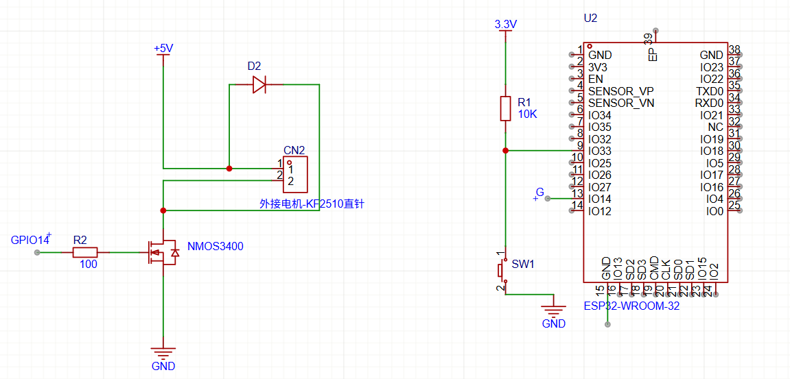
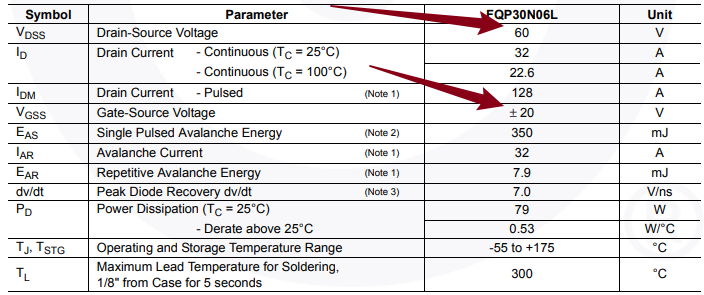

# 调速小风扇
## 要求

>  使用MOS管，esp32，直流有刷电机，按钮，制作一个调速小风扇
>
>  实现功能: 开机风扇不转，按一下按钮转速 30%，再按一下按钮转速60%，再按一下风扇转速100%，再按一下风扇转速30%...以此类推，长按按钮两秒关闭风扇
>
>  学会MOS管选型，可以手绘电路图（或**建议**使用“立创EDA”画出电路图）
>  然后去淘宝上购买相关材料，并且完成该项目
>
>  需要学会的内容： PMOS和NMOS区别（分别画出两个电路图），PWM调速原理(有效电压），MOS-Gate上下拉电阻（并且知道如果没有会发生什么，应该选多大?为什么?)
>
>  代码格式化后提交，代码优雅不要堆积如山

## 学习过程

选型：

1 . MOS管：AO3400A

​     选择理由：最大耐压为60V，也就是D和S极之间的最大电压为60V，我选的是5V电机，可以；G和S之间的不能超过±20v，符合；

2 . 二极管：1N5819

​      选择理由：插针（适合我的面包板）耐压值为40V，风扇在5V完全够用，平均正向电流是1A,瞬间最大电流位25A，速度快，适合电机续流保护

> 为什么需要二极管呢：
>
> 因为电机本质上是个电感，电机通电的时候如果MOS突然断电，电感为了维持电流不变（假设没有二极管）会在MOS上面产生一个巨大的电压直接把MOS击穿

>如果没有会产生多大的反向电压呢？
>
>会产生多大反向电压，不是一个固定值，它取决于电机电感、电流、MOS 关断速度等
>
>估算公式: V = L × ΔI / Δt
>
>L  = 电机绕组电感
>ΔI = 关断前电机电流
>Δt = 电流被切断的时间

电机高速小马达：淘宝链接（从朱方获取）

## 结论

把需要学会的内容写在这里

