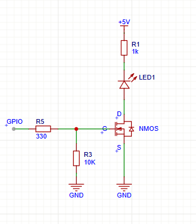
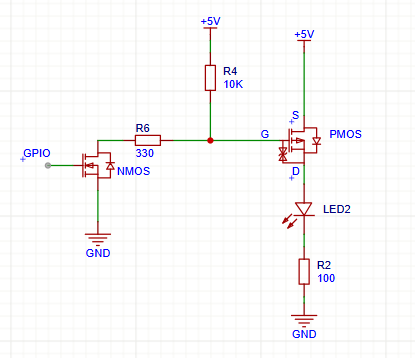
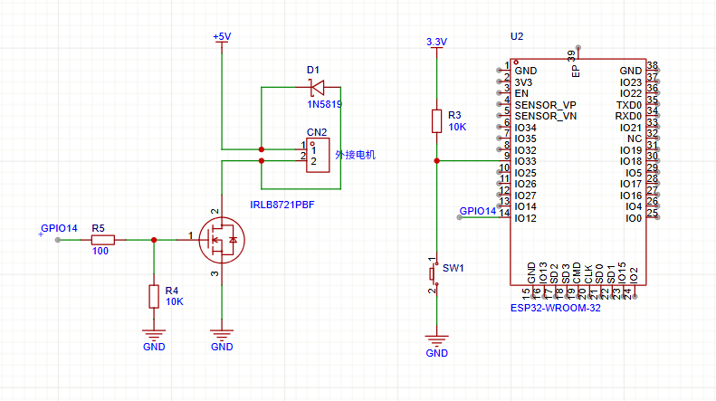
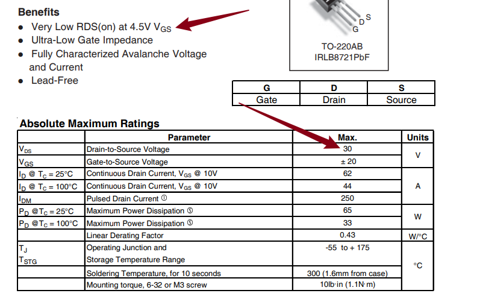
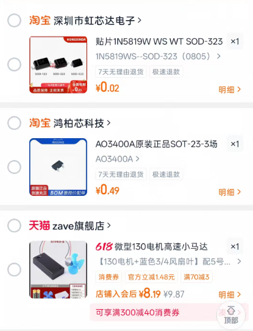

# 调速小风扇
## 要求

>  使用MOS管，esp32，直流有刷电机，按钮，制作一个调速小风扇
>
>  实现功能: 开机风扇不转，按一下按钮转速 30%，再按一下按钮转速60%，再按一下风扇转速100%，再按一下风扇转速30%...以此类推，长按按钮两秒关闭风扇
>
>  学会MOS管选型，可以手绘电路图（或**建议**使用“立创EDA”画出电路图）
>  然后去淘宝上购买相关材料，并且完成该项目
>
>  需要学会的内容： PMOS和NMOS区别（分别画出两个电路图），PWM调速原理(有效电压），MOS-Gate上下拉电阻（并且知道如果没有会发生什么，应该选多大?为什么?)
>
>  代码格式化后提交，代码优雅不要堆积如山

## 学习过程

#### 1.PMOS和NMOS区别

PMOS就是导通之后，沟道是P型载流子，如果沟道里面是N型载流子则是NMOS.

​     首先就是G极到S极的电压不一样NMOS导通的条件是VGS>0,而PMOS导通的条件是VGS<0；其次连接方式也不一样，NMOS是下管，PMOS是上管。 下图分别是我的NMOS和PMOS的电路图。

​                                                       

PMOS的就是在GPIO输入端输入一个高电平把小NMOS导通，之后PMOS的G极就可以收到一个低电平，从而导通了

#### 2.PWM调速原理

就相当于一个告诉开关比如MOS管这种，去控制供电。比如转速为30%，那就让这个MOS控制一个周期里面30%的时间给高电平，让风扇由于惯性区转动。ESP32并不直接控制风扇，只负责发PWM信号，而MOS负责执行，风扇因为惯性表现出不同的转速。

#### 3.MOS GATE的上下拉电阻

作用在GPIO没有明确输出的时候给G极一个明确的电平，防止MOS管乱开，最常用的是10kΩ，不会浪费太多电流0.33mA和0.5mA完全在ESP32的承受范围内，选用电阻太大的会导致不稳定，选择电阻太小的会浪费电流。

#### 4.原理图

#### 5.选型：

1 . MOS管：IRLB8721PBF

​     选择理由：最大耐压为30V，也就是D和S极之间的最大电压为30V，我选的是5V电机，可以；4.5V 栅极电压下导通电阻也很低。虽然 ESP32 是 3.3V，不是 4.5V，但这已经说明它更适合低压驱动。

2 . 二极管：1N5819

​      选择理由：插针（适合我的面包板）耐压值为40V，风扇在5V完全够用，平均正向电流是1A,瞬间最大电流位25A，速度快，适合电机续流保护

> 为什么需要二极管呢：
>
> 因为电机本质上是个电感，电机通电的时候如果MOS突然断电，电感为了维持电流不变（假设没有二极管）会在MOS上面产生一个巨大的电压直接把MOS击穿

>如果没有会产生多大的反向电压呢？
>
>会产生多大反向电压，不是一个固定值，它取决于电机电感、电流、MOS 关断速度等
>
>估算公式: V = L × ΔI / Δt
>
>L  = 电机绕组电感
>ΔI = 关断前电机电流
>Δt = 电流被切断的时间

>电感电流方向在关断的瞬间不变，电感电压方向会翻过来，以维持这个电流继续
>
>电感感应电压的方向总是反抗电流的方向，电流增加他就会产生一个反向电压组织电流增加，电流减小就产生一个反向电流阻止他减小

电机高速小马达：淘宝链接（从朱方获取）

## 结论

把需要学会的内容写在这里

