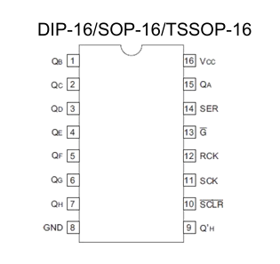
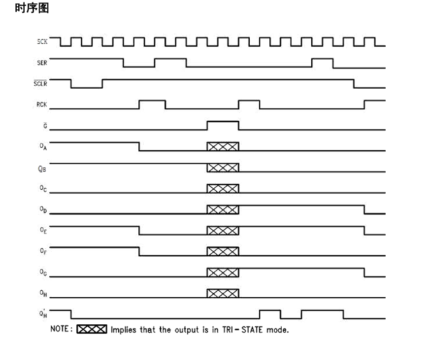
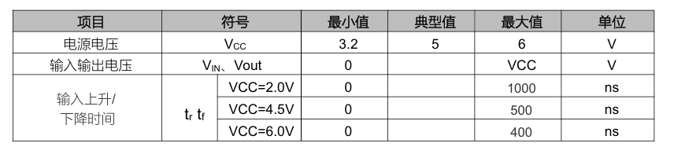
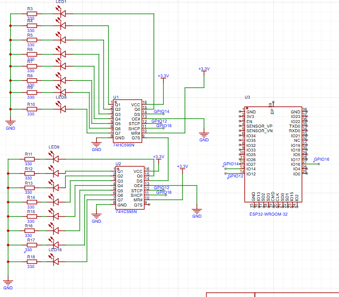
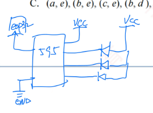
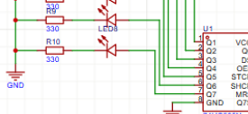
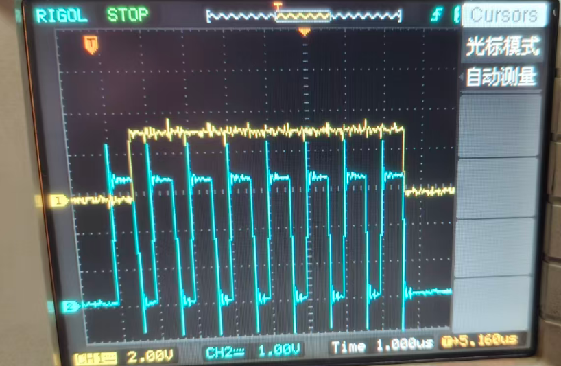
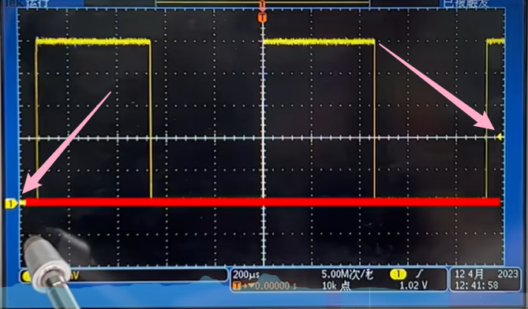
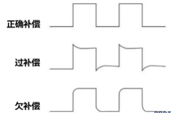
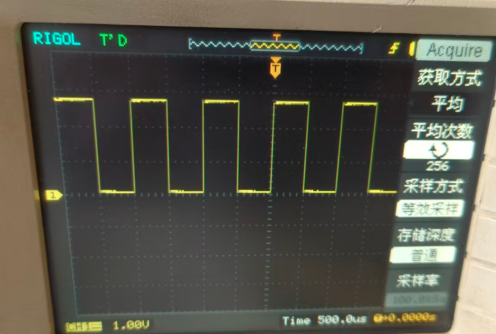

# 点亮多个LED
## 要求

>  要求使用**3**个引脚控制16个LED，学会硬件SPI以及软件模拟控制
>  实现效果: 实现流水灯效果（例如：从第 1 个 LED 依次亮到第 16 个，再依次熄灭，或者跑马灯效果）
>  两个函数，硬件SPI控制函数，软件SPI控制函数，函数定义: void func_name(uint16_t led_state); 输入16进制完成控制
>
>  可以手绘电路图（或**建议**使用“立创EDA”画出电路图）
>  阅读74HC595数据手册，并且使用2片芯片解决问题（以后老板只会和你说他要用3个引脚控制16个LED，不会告诉你具体用什么芯片！！你必须自己想办法找解决方案）
>  注意上下拉电阻和限流电阻(在README中写出为什么要配置这么大的阻值)
>
>  代码格式化后提交，代码优雅不要堆积如山

## 学习过程

#### 1.核心思想：

​     就是把两片74HC595串联起来，然后把16位数据一位一位的送入进去，然后统一所存输出

> 74HC595是移位寄存器，而且是传入并出（8位）

#### 2.读数据手册

##### 3.封装



##### 4.时序图



| 名称 | 作用                                                 |
| ---- | ---------------------------------------------------- |
| SCK  | 位移时钟，负责控制数据一位一位输入                   |
| SER  | 数据                                                 |
| SCLR | 移位寄存器清零，低电平有效（接的时候有一个上拉电阻） |
| RCK  | 把数据刷新到输出端                                   |
| G    | 输出端使能或关闭（低电平有效）                       |

74HC595在时钟信号的上升沿读取SER的内容；

可以把74HC595理解成两部分，第一部分由SCK控制负责读数据，放在移位寄存器中；第二部由RCK控制分负责输出锁存器中的内容。其中RCK在出现上升沿的时候有效。SCK只把数据送进去，只有当RCK出现上升沿的时候才会被复制到QA-QH。

QA-QH是真正的LED输出引脚，但是他不会随着SER的变化而变化，他在RCK有动作之后会整体更新

QH负责级联下一篇芯片的输出，也就是如果我一次发送16位数据，前八位会进入第二片，后八位进入第一片，最后给一个RCK信号会一起输出

##### 5.工作条件



##### 6.电路原理图




> 只有两片74HC595，第二个74HC595 的Q7S引脚可以悬空就可以了

在连接实际电路的时候因为杜邦线不够了，就按照朱说的把电阻给剪了连接的(失败，最后还是等杜邦线来了)

> 为什么这个限流电阻选择330欧姆的？
>
> 因为这个LED的压降大概是2V，希望流过LED的电流是5mA
>
> ```
> R = (3.3V - 2.0V) / 0.005A = 260Ω
> ```
>
> 选择一个值接近260Ω的电阻就选了330Ω的

##### 7.软件SPI控制函数

```
void shiftOutSoft(byte data) {
  for (int i = 7; i >= 0; i--) {
    //形成时钟的
    digitalWrite(CLOCK_PIN, LOW);
    if (data & (1 << i)) {
      digitalWrite(DATA_PIN, HIGH);
    } else {
      digitalWrite(DATA_PIN, LOW);
    }

    digitalWrite(CLOCK_PIN, HIGH);
  }
}
```

软件SPI就是自己控制数据线，时钟线以及自己决定什么时候所存；任何的GPIO都可以使用，缺点就是速度慢占用CPU，因为执行期间，单片机一直手打时钟拍子

```c++
void write595(uint16_t value) {
  if (LED_ACTIVE_LOW) {
    value = ~value;
  }
```

还有一种接法是595当GND用，灯的+极接VCC，负极接595，当595高电平灯不亮，低电平亮(就像下面那种，低电平有效)



正常我是这样的高电平有效


##### 8.硬件SPI

是单片机内部自带的通信外设（高速串行发送模块），有软件SPI做的事情硬件SPI自己就做了，只需要调用函数就可以

```
void hardware_spi_control(uint16_t led_state) {
  uint8_t highByteData = (led_state >> 8) & 0xFF;
  uint8_t lowByteData  = led_state & 0xFF;

  digitalWrite(LATCH_PIN, LOW);

  mySPI.beginTransaction(SPISettings(1000000, MSBFIRST, SPI_MODE0));
  mySPI.transfer(highByteData);
  mySPI.transfer(lowByteData);
  mySPI.endTransaction();

  digitalWrite(LATCH_PIN, HIGH);
  delayMicroseconds(1);
  digitalWrite(LATCH_PIN, LOW);
}
```

##### 10.波形图



##### 11.示波器的使用

用于测量电压信号



左侧箭头指的是通道零电平的位置；右侧电平指的是触发电平的位置

level触发电平要尽量的放在上升沿或者下降沿的地方，这样图像会看起来是静止的，如果放在方波外面会一直动。

可以捕捉单次的方波，比如，带有下拉电阻的按钮，在最右侧menu中设置参数，这种一般就将触发方式设置成单次，因为带有下拉电阻，平时是高电平只有在低电平的时候触发，所以应该捕捉下降沿，把level触发电平调整到下降沿所在的位置，即可捕捉

耦合方式中：

接地就相当于探头和鳄鱼夹加在一起了，图像显示就是一条直线

每一个信号都可以分成直流分量和交流分量，一般情况下使用直流耦合，在看电源的纹波的时候会用到交流耦合

cursor是光标，可以选择X轴和Y轴分别显示时间和电压的准确信息（一般用不到）

6.24



这种情况就是发生了探头过补偿，解决方法就是把哪个黑色的改锥伸进探头后面扭，扭到垂直了就行了。这里注意探头是10x的示波器对应ch1探头就选10x的

还有就是我调整好了已经成垂直的了过一会又会出现欠补偿状态，可能是硬件本身漂移，无缘探头内部补偿微调电容老化也有可能是示波器输入通道前端电容温度漂移，反正左右就是老化了。上面说这个示波器还要预热20-30分钟，等机箱温度稳定后，在做探头校准。（可是朱一指导就好了，不知道为什么）

还学习了怎么用光标去测量周期和电压；学习了怎么抓取波形，一般情况下用的都是自动，那个普通模式就是探头搭上一次它波形变化一下，单次就用来抓那种只一下的波形比如掉电的时候 。

在朱的指导下学习了一下两个通道一起用，就是先测出第一个通道我想要的东西，然后关掉，然后校准第二个通道的波形，测出第二个想要的，最后把一通道打开，能看到两个波形，就像上面第10个小标题那样的东西

