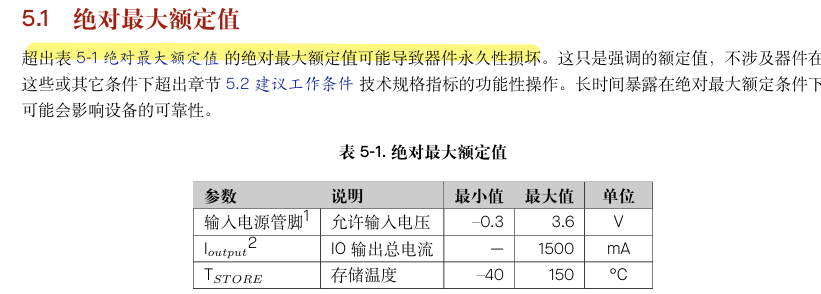
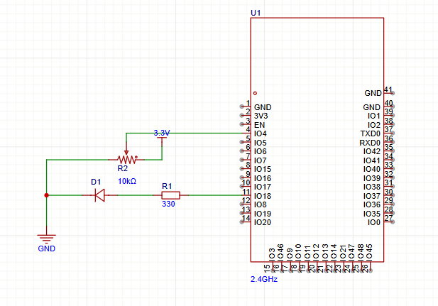

# 电位器ADC调光

## 要求

> 使用ESP32，电位器，LED，完成一个ADC采集小实验
>
> 实现功能: 旋转电位器，ESP32读取ADC原始值，并在串口监视器中输出，同时让LED亮度跟着变化
>
> 自己去网上找电位器购买，自己设计分压电路
>
> 需要学会的内容：ADC采样原理，ESP32 ADC输入范围，为什么不能超过3.3V，分压电路怎么接，ADC值和LED调光的关系
>
> 代码格式化后提交，代码优雅不要堆积如山

## 学习过程

在ESP32里有两个ADC模块，分别是ADC1对应引脚GPIO1~10和ADC2对应引脚GPIO11-20,通常情况下用ADC1

##### 1.ADC采样原理

把连续的模拟电压，变成可以用数字表示出来的电压（采样——量化——编码）

##### 2.ESP32 ADC输入范围，为什么不能超过3.3V

ESP32 的 ADC 管脚属于 3.3 V 电源域，输入范围是0-3.3V，在ESP32的引脚内部通常是有保护结构的，超过3.3V一定幅度的时候内部保护结构被导通，电流会从ADC引脚倒灌进3.3V电源。而且在手册上也说到了，超过最大额定值可能造成永久损坏，虽然最大额定值是3.6V

##### 3.分压电路怎么接

##### 4.ADC值和LED调光的关系

LED是通过PWM信号来控制的，也就是电位器旋转产生模拟电压，然后经过ESP32里面的ADC转换器转换为数字值，将数字值映射到PWM上，在输出得到了对应亮度的LED光，PWM越大，LED的亮度越亮。

##### 演示

<video src="README.assets/ADC.mp4"></video>
