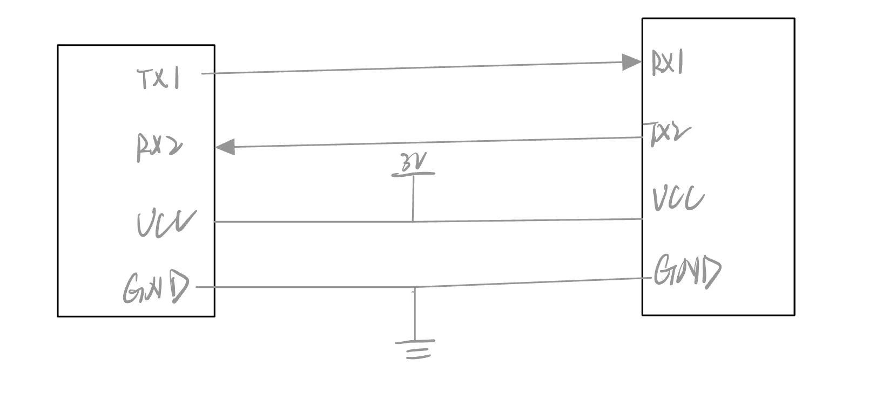

# ESP32 双板 UART 转发到 OLED

## 要求

> 使用两块 ESP32 和一个 SSD1306 OLED，完成一个双板 UART 通信实验
>
> 实现功能：电脑串口监视器输入文字给 ESP32A，ESP32A 通过板间 UART 转发给 ESP32B，ESP32B 收到后显示到 SSD1306 OLED 上，同时 ESP32B 的串口监视器也能看到收到的内容
>
> 需要学会的内容：ESP32 多串口的区别，`Serial` 和 `Serial2` 分别连接谁，TX/RX 怎么接，为什么要共地，串口缓冲区，波特率，等等
>
> 代码格式化后提交，代码优雅不要堆积如山

## 功能要求

1. ESP32A 打开串口监视器后，用户可以输入一行文字。
2. ESP32A 读取电脑发来的文字，并通过 `Serial2` 发送给 ESP32B。
3. ESP32B 通过 `Serial2` 接收文字。
4. ESP32B 把收到的文字打印到自己的串口监视器。
5. ESP32B 把收到的文字显示到 SSD1306 OLED 上。
6. 如果收到空字符串、乱码或超长字符串，需要有基本处理。

## 验收标准

1. 电脑 A 的串口监视器输入 `hello`，OLED 能显示 `hello`。
2. 电脑 B 的串口监视器能打印收到的原始内容。
3. 拔掉 GND 后能解释为什么通信会不稳定或失败。
4. 故意把波特率设置错一次，记录乱码现象和解决方法。
5. 能画出 ESP32A、ESP32B、OLED 的接线图。

## 学习过程

##### 1.ESP32 多串口的区别

ESP32-S3有三个UART控制器，串口功能基本一样，区别在于默认引脚，是否常被系统日志/烧录占用，以及是否有专用的IO_MUX直连脚。

| 串口      | 常见用途                         | 默认 IO_MUX 引脚                             |
| --------- | -------------------------------- | -------------------------------------------- |
| **UART0** | 下载、启动日志、串口调试、控制台 | TX=GPIO43，RX=GPIO44，RTS=GPIO15，CTS=GPIO16 |
| **UART1** | 外设通信，比较推荐               | TX=GPIO17，RX=GPIO18，RTS=GPIO19，CTS=GPIO20 |
| **UART2** | 外设通信，也推荐                 | 无专用 IO_MUX 引脚                           |

TX:是发送线；RX:接受线；RTX：请求发送；CTS：允许发送（后两个可以控制速度，以防数据丢失，不过chatgpt说我这种菜鸟还用不上RTX和CRT这种高端货。通常接TX,RX,GND就可以，还要有电源）

##### 2.`Serial` 和 `Serial2` 分别连接谁

Serial一般连接电脑调试用，就是看信息，通常对应UART0，Serial2一般接的是给外部模块用的串口，没有默认引脚，可以自己设置

##### 3.TX/RX 怎么接

大概就这样

##### 4.为什么要共地

如果不共地就，两个设备没有一个共同的参考标准，会分不清高低电平，到时候可能会收到一堆乱码。

波特率：就是通信的速度，两个通信的东西他的波特率要一致

串口缓冲区：支持FIFO，Serial.available（）相当于在问，这个缓冲区里有没有东西，如果有的画可以用read（）读出来。但是如果没有及时读出来，然后缓冲区满了的话，就会导致新来的数据丢了

