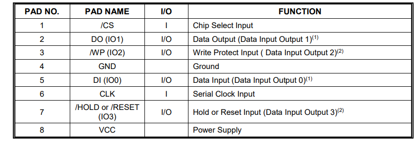

# W25Q32 SPI Flash 读写实验

## 要求

> 实现功能: ESP32 上电后先读取 W25Q32 的 JEDEC ID，并在串口监视器中输出；随后向指定地址写入一段字符串或测试数据，再立即读回校验；断电后再次上电，仍然能够读到之前写入的数据(串口写入芯片，掉电重启后串口打印之前保存的数据)
>
> 使用“立创EDA”画出电路图
>
> 需要学会的内容：SPI 四根线怎么接，CS 为什么不能乱拉低，MOSI/MISO/SCK 的作用，W25Q32 的引脚定义，各类寄存器等
>
> 保存数据手册到 ./datasheet 下面

## 学习过程

这个东西就相当于一个通过SPI访问的8MB的外部Flash存储器（就相当于访问存储器，通过MCU控制的），供电在2.7-3.3V（所以我在插的时候选那个3.3V 的），容量8MB

地址范围：0x000000 ~ 0x7FFFFF

关于读写：它有32768个页，每个页大小256B，一次最多写一个页；可以从任意位置连续读，最小通常擦 4KB。RAM可以直接更改，而Flash需要先擦再写

这个芯片的八个引脚分别是干啥用的：



这个芯片有3个状态/配置寄存器，然后ai说新手阶段的我重点关注SR1，驱动里面最常用的：

```c++
BUSY = SR1 & 0x01;
WEL  = SR1 & 0x02;
```


##### SPI

|  线名   |                             作用                             |
| :-----: | :----------------------------------------------------------: |
|  SS/CS  | 片选线（一般是低电平有效），表示这个芯片被选中了，开始对这个芯片进行操作 |
| SCKCLK  | 时钟线，由主设备产生，打拍子，每产生一个上升沿或者下降沿去读取一个数据 |
| MOSI/DI |              msater out slave in  主输出从输入               |
| MISO/DO |                         主输入从输出                         |

 JEDEC ID相当于一个身份信息，可以看出来这是什么公司生产的，存储器类型是什么，以及容量大小

容量：8MB

地址范围：0x000000 ~ 0x7FFFFF

有32768个页，每个页256B

##### 遇到的问题

  我在串口输入的数据是可以被精确检测到的，但是断电重新上电之后的输出却变成了乱码。豆包给我讲的是，有可能是在Flash中文字部分写完了，然后写校验头部的过程中我就断电了，扇区中的文字是完好的，但是头部是乱的，这时候会把残缺的头部当成有效数据，然后导致读出来乱码。解决方案是先把擦除掉的扇区用空白头部占上，代表还没有操作完，然后再写正文，最后写上有效头部

  还有就是上电只读取一次头部，SPI信号抖动就会出错解决方法是连续读两次头部，然后对比，如果一致采取，不一致舍弃。

  然后代码也不是我自己写的，我问过朱某，说我只要理解这个SPI通信就可以了。SPI通信的流程是拉低CS线，然后主机在SCK的上升沿发送数据，在SCK的下降沿去接收从机的数据，主机可以产生时钟信号，从机是没办法自己产生时钟信号的，在读取JEDCE ID的时候就是主机先发出一个字节的控制命令0x9f，主机必须持续输出SCK时钟信号（3个字节），以便读取从机发过来的信息；SPI.transfer()的作用是发送一个字节的同时接收一个字节。
