# CLion + ESP-IDF HelloWorld 跑通实验

## 要求

> 使用 CLion 和 ESP-IDF 完成第一个最小工程，把 HelloWorld 跑通
>
> 实现功能: 正确安装 ESP-IDF 工具链和相关依赖，在 CLion 中打开或创建 ESP-IDF 工程，完成编译、烧录和串口监视，最终在串口中看到设备启动日志和 HelloWorld 输出
>
> 需要学会的内容：ESP-IDF,CMake 是什么，工程目录结构是什么样，`idf.py` 的基本作用，CLion 里怎么选择目标芯片，怎么编译、烧录，menuconfig， monitor，串口号怎么看，编译失败和烧录失败怎么排查，会调试打断点
>
> 这个实验不要求外设，只要求把开发环境跑通 (彻底卸载原来的espidf 安装最新版本)

## 步骤

1. 安装 CLion **最新版本**
2. 安装 ESP-IDF 和工具链
3. 新建 `hello_world` 工程并保存到当前目录下
4. 选择正确的开发板型号和串口
5. 编译工程
6. 烧录到 ESP32
7. 打开串口监视器，确认能看到 `Hello world!` 和启动信息
8. 会使用调试器，修改运行中的变量 比如 for 循环打印数字，for (int i = 0; i < 10; i++) 可以随意修改i的大小

## 相关教程
- https://www.youtube.com/watch?v=6qR9nHm4HDQ
- https://docs.espressif.com/projects/esp-idf/zh_CN/v6.0.1/esp32/get-started/index.html

## 学习过程

打印helloworld

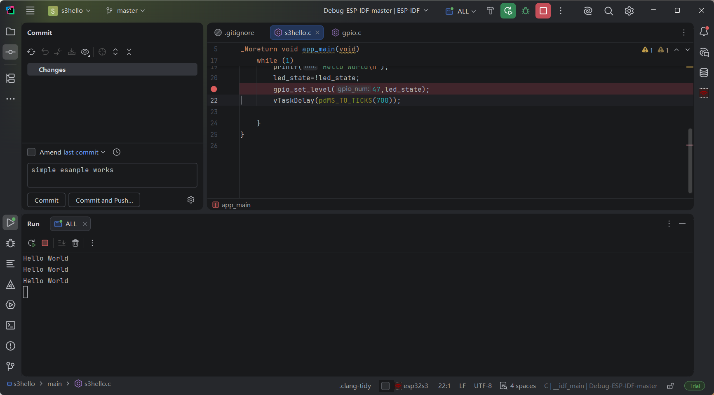

##### 一些步骤，忘记的时候可以回来看看

就是在powershell中先创建我要的一个项目名字，但是先不要build，然后再Clion中打开这个

在开头会有一个页面跳出来，这个时候就要设置一些东西，像toolchain(改成ESP-IDF-master)，CMake options（-IDIF_TARGET=esp32s3）,build directory(build)

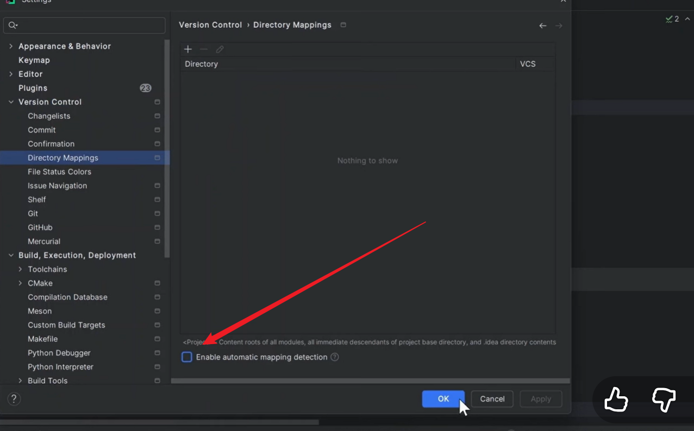

上面列表里面的东西清空，然后把这个东西关了

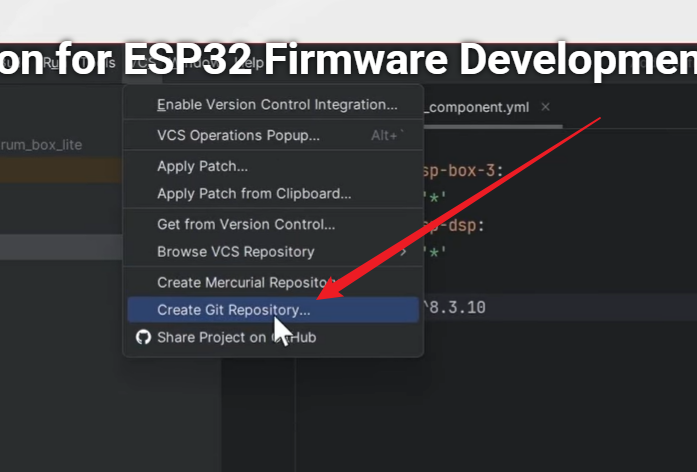

把Git打开

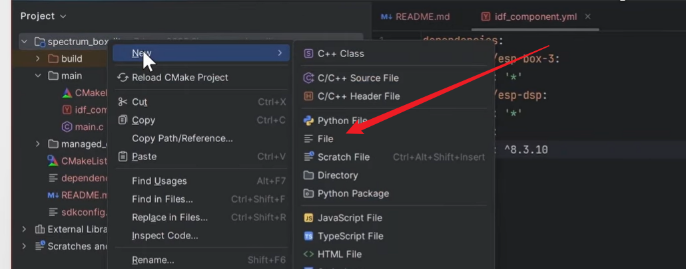

创建一个.gitignore文件

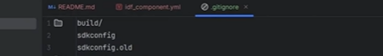

这个文件会放一些东西

写代码，然后点锤子

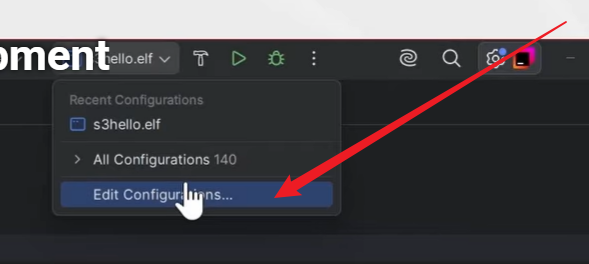

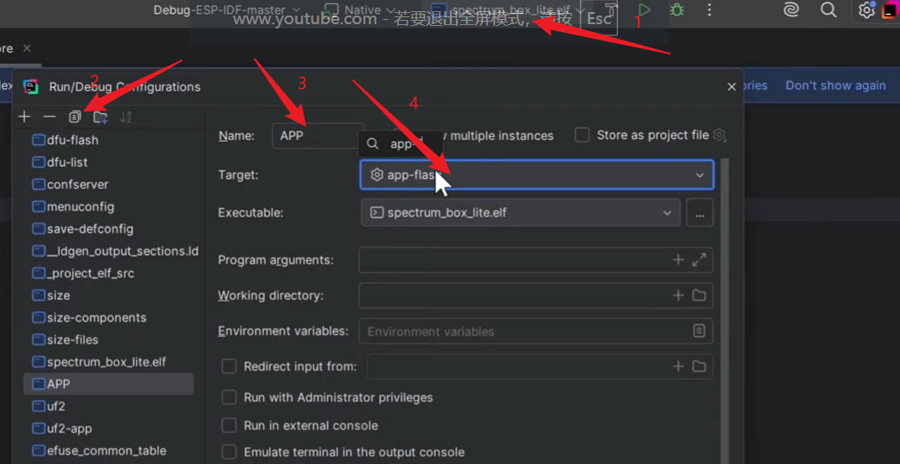

然后这样，先创建一个文件夹叫ESP,APP 放在里面，然后呢在用同样的方法创建ALL和DEBUG,在创建DEBUG的时候把before launch中的build减了

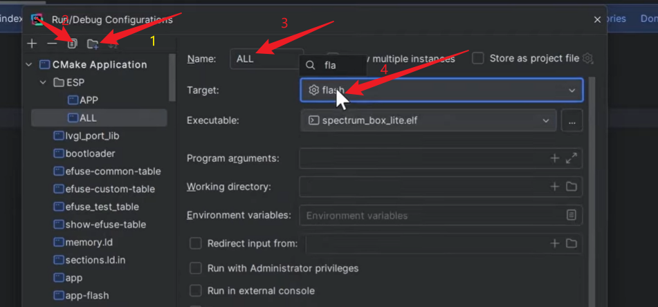

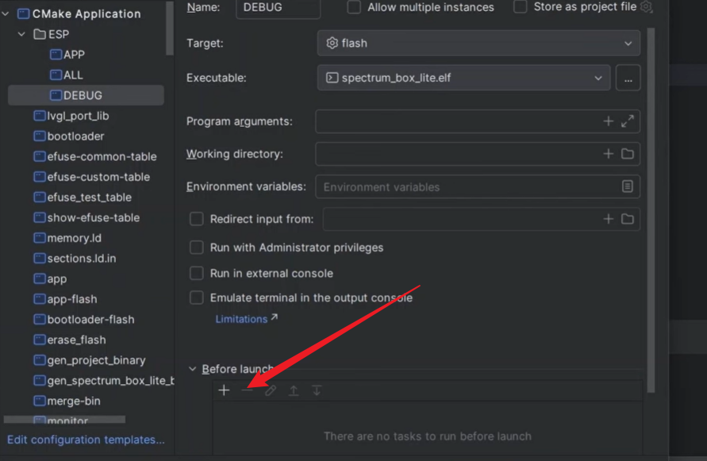

然后DEBUG SERVERS中这样改

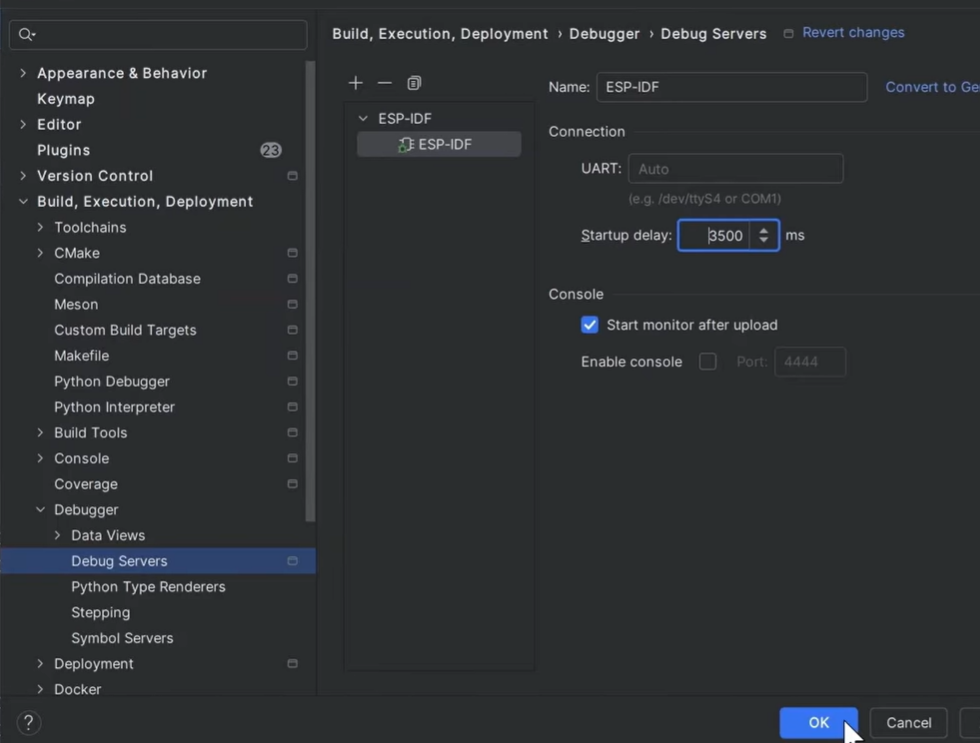

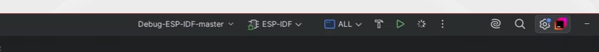

上面这个头长这样,然后点击虫子，就可以了

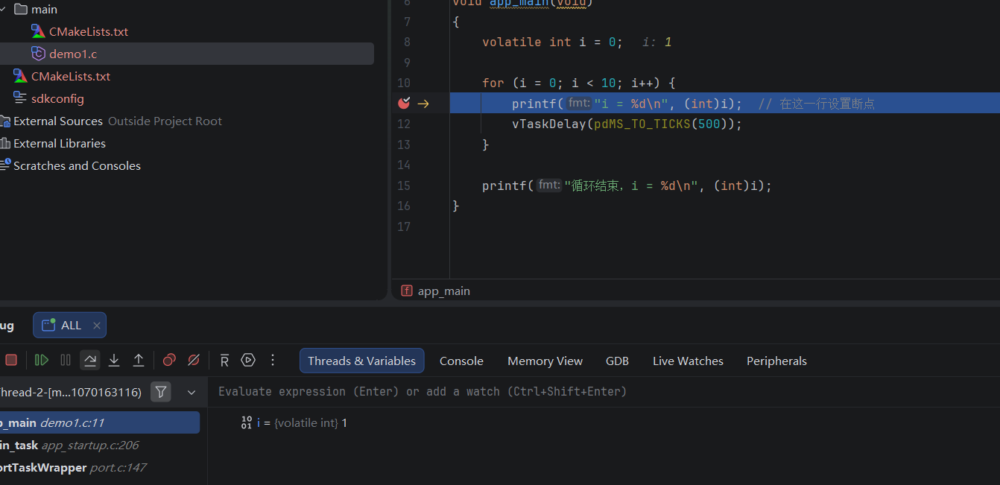

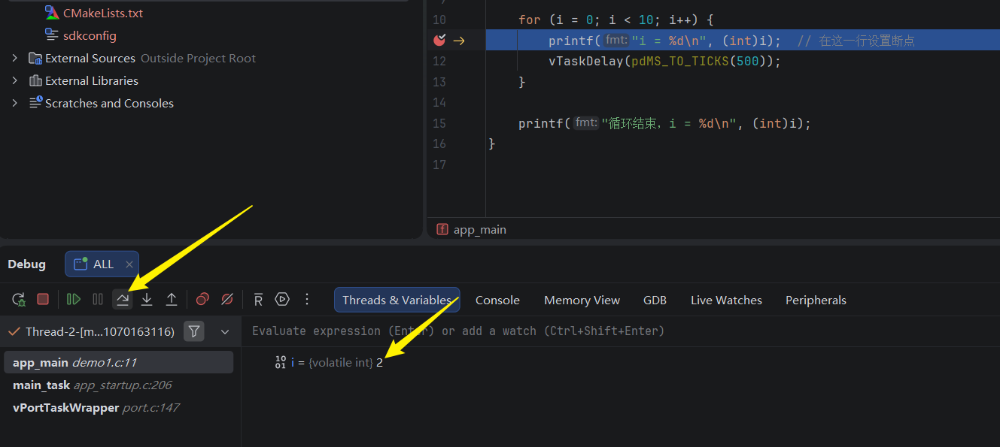

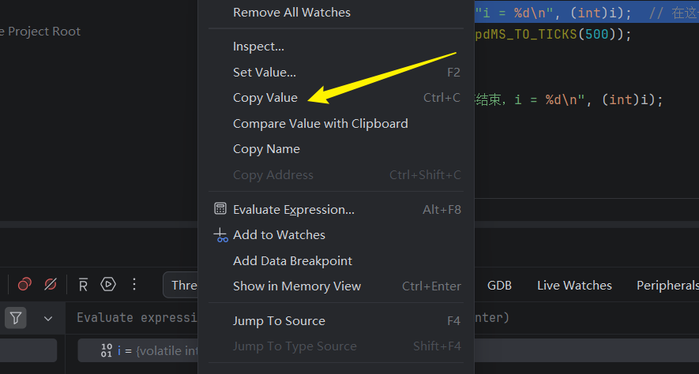

点这个可以更改值
